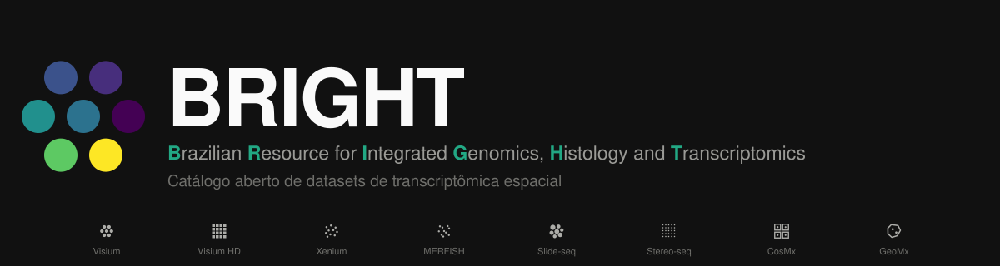

<p align="center">
  
</p>

<p align="center">
  <b>Brazilian Resource for Integrated Genomics, Histology and Transcriptomics</b>
</p>

<p align="center">
  <a href="https://marcostoquetao.github.io/BRIGHT/"></a>
  <a href="https://github.com/MarcosToquetao/BRIGHT/actions/workflows/varredura.yml"></a>
</p>

## 🔎 Sobre

BRIGHT é um catálogo aberto de datasets de **transcriptômica espacial**. Ele reúne metadados e links de download de estudos públicos, para você decidir rápido se um dado serve para o seu trabalho. O site não hospeda nem processa dado nenhum. Ele aponta para o repositório de origem de cada estudo.

🌐 **Site:** https://marcostoquetao.github.io/BRIGHT/
🇧🇷 Interface em português por padrão, com alternância para inglês.

## 🧬 O que você encontra

Todo dataset admitido no catálogo tem, no mínimo, estes campos conferidos:

- 🔬 **Tecnologia**: Visium, Visium HD, Xenium, MERFISH, Slide-seq, Stereo-seq, CosMx, GeoMx e outras
- 🧫 **Tecido** e **organismo** (humano, camundongo, rato, peixe-zebra, primata não humano)
- 🩺 Se a amostra é **tumoral**, e o tipo de câncer quando aplicável
- 🖼️ Se existe **imagem H&E** pareada ou corregistrada
- 🔗 Link direto para o **repositório de download**

A home do catálogo é uma matriz tecnologia × tecido: cada célula mostra quantos datasets existem naquele cruzamento e filtra a tabela abaixo ao clicar.

## 🗂️ Estrutura do repositório

```
BRIGHT/
├── index.html             página única do site (catálogo, detalhe, submissão, sobre)
├── css/styles.css         identidade visual
├── js/
│   ├── app.js             carregamento de dados, filtros, tabela, página de detalhe
│   ├── panorama.js        matriz tecnologia × tecido e os leitores de organismo/tumor/H&E/acesso
│   ├── schema.js          campos do catálogo e vocabulário controlado
│   ├── i18n.js            textos da interface e tradução dos valores (PT/EN)
│   └── config.js          de onde o site lê os dados
├── data/
│   ├── catalog.json       o catálogo publicado, o que o site mostra
│   ├── portais.json       bancos agregadores de terceiros ("onde mais procurar")
│   └── review_queue.json  candidatos que a varredura encontrou mas não confirmou sozinha
├── scripts/varredura.py   descoberta automática de datasets no GEO
├── .github/workflows/     a rodada semanal da varredura
└── docs/GUIA.md           guia de configuração
```

## ⚙️ Rodando localmente

Site estático, sem build. Como ele carrega os arquivos JSON via `fetch`, sirva com um servidor local em vez de abrir o `index.html` direto:

```bash
python3 -m http.server 8000
```

Acesse http://localhost:8000.

## 🔄 Como o catálogo é atualizado

Toda segunda-feira, um [workflow do GitHub Actions](.github/workflows/varredura.yml) busca datasets novos direto no GEO. Ele procura o dataset em si, não o artigo sobre ele, e extrai tecnologia, tecido, organismo, status tumoral e H&E com fonte e evidência citada por campo. Ao final, abre um **pull request**: nada entra no catálogo sem esse PR ser revisado e mesclado.

- ✅ Só entra automaticamente na proposta o que tiver os cinco campos mínimos confirmados por método determinístico.
- 🗃️ O que não completa esses campos vai para `data/review_queue.json`, para revisão manual.
- 📈 `varredura/agreement.json` mede, a partir do histórico de PRs mesclados, a concordância por categoria. Quando uma categoria acumula confiança suficiente, ela passa a ser publicada automaticamente.

Detalhes do mecanismo em [`varredura/README.md`](varredura/README.md).

## ➕ Contribuindo com um dataset

Use o formulário linkado na aba **Submeter** do site. Se souber, inclua o accession do dado (GSE, E-MTAB, Zenodo...): é o que permite conferir que o dataset existe de fato e evitar duplicar um que já reusa dados publicados em outro estudo.

## 🙌 Curadoria

Mantido por **Marcos Lemes Toquetão**. Revisão semanal da literatura e dos repositórios públicos.
